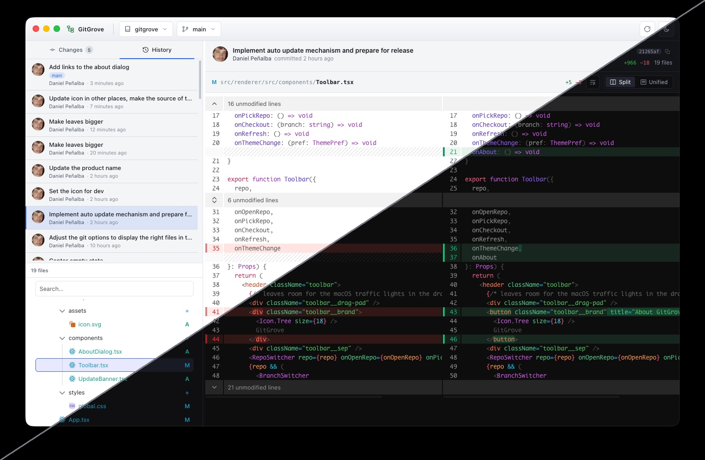

# 🌳 GitGrove

A fast, beautiful desktop app for reading your git repositories. Open any repo to
browse your working changes and full commit history, and read syntax‑highlighted
diffs — split or unified, light or dark.

GitGrove is a **viewer**: it stays out of your way while you write commits in your
editor or terminal, and gives you a clear, calm window onto what changed.



## Install

Download the latest version for your platform from the
[**Releases page**](https://github.com/danipen/gitgrove/releases/latest):

- **macOS** — `.dmg` (universal; Intel + Apple Silicon)
- **Windows** — `.exe` installer (x64 / arm64)
- **Linux** — `.AppImage`

GitGrove updates itself: it checks quietly on launch and offers a one‑click restart
when a new version is ready. You can also check any time from **Help ▸ Check for
Updates…**

> **You'll need `git` installed.** GitGrove reads repositories through the `git`
> command line. If it isn't found, the app walks you through installing it (and will
> happily use the copy bundled with GitHub Desktop).

## What you can do

- **Open any repository** from the folder picker, and jump back into recent ones from
  the welcome screen.
- **Switch branches** — local or remote — straight from the toolbar; GitGrove checks
  them out in place.
- **Browse your changes** in the **Changes** tab: a status‑colored file tree (added,
  modified, deleted, renamed, untracked) with a diff for every file.
- **Explore history** in the **History** tab: the commit log with refs and tags. Pick
  a commit to see exactly what it changed, then click a file for its diff.
- **Read diffs that are a pleasure to read** — word‑level intra‑line highlighting,
  Split or Unified layout, line‑wrap toggle, and expandable context.
- **Stay in sync automatically** — GitGrove watches the repo and refreshes as you
  commit, checkout, or edit, without disrupting the diff you're reading.

It never writes to your repository beyond checking out branches — no staging, no
commits, no surprises.

## Contributing

GitGrove is an [Electron](https://www.electronjs.org) + [React](https://react.dev)
app. The renderer never touches git directly: it talks to the main process through a
typed, sandboxed bridge (`contextIsolation` on, `nodeIntegration` off), and all git
work happens in the main process via [`simple-git`](https://github.com/steveukx/git-js)
and raw `git` for precise patch output. The file tree and diffs are rendered with
[`@pierre/trees`](https://trees.software) and [`@pierre/diffs`](https://diffs.com).

You'll need [Bun](https://bun.sh) and `git` on your PATH.

```bash
bun install        # install dependencies
bun run dev        # launch the app with hot reload
bun run typecheck  # type-check the whole project
bun test           # run the test suite
bun run lint       # lint + format check (Biome) — same command CI runs
bun run lint:fix   # auto-fix lint + formatting
```

CI runs lint, typecheck, tests and a per‑platform build on every PR (macOS, Windows,
Linux), plus an end‑to‑end smoke test and a CodeQL scan — so green locally means green
in CI.

### Cutting a release

Releases are one button: **Actions ▸ Release ▸ Run workflow**, pick the bump level. The
workflow bumps the version, tags it, builds installers on every OS, and opens a draft
GitHub Release with generated notes. Review the notes (they show verbatim in the in‑app
update banner) and click **Publish**.

## License

GitGrove's own source is [MIT](LICENSE). It bundles open‑source dependencies under
their own permissive licenses; their notices ship inside every distributable.
</content>
